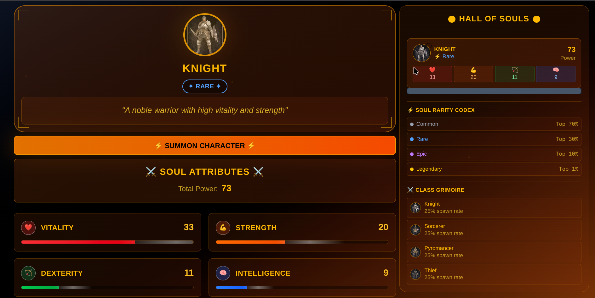

# ⚔️ Dark Souls Character Generator

Dark Souls themed character generator using MagicBlock verifiable random function (VRF) to generate random character stats and classes. This is extended from the [MagicBlock roll dice example](https://github.com/magicblock-labs/magicblock-vrf-example).

# Demo



[https://dark-souls-vrf.vercel.app/](https://dark-souls-vrf.vercel.app/)

## Features

- **Verifiable Random Generation**: Uses MagicBlock VRF for provably fair character generation
- **Dark Souls Theme**: Four character classes (Knight, Sorcerer, Pyromancer, Thief) with unique attributes
- **Rarity System**: Common, Rare, Epic, and Legendary characters with different spawn rates
- **Character History**: Track your generated characters in the Hall of Souls
- **Blockchain Integration**: Characters are stored on Solana blockchain using Phantom wallet

## Software Packages

This program has utilized the following software packages.

| Software   | Version | Installation Guide                                              |
| ---------- | ------- | --------------------------------------------------------------- |
| **Solana** | 2.1.18  | [Install Solana](https://docs.anza.xyz/cli/install)             |
| **Rust**   | 1.86.0  | [Install Rust](https://www.rust-lang.org/tools/install)         |
| **Anchor** | 0.31.1  | [Install Anchor](https://www.anchor-lang.com/docs/installation) |

```sh
# Check and initialize your Solana version
agave-install list
agave-install init 2.1.18

# Check and initialize your Rust version
rustup show
rustup install 1.86.0

# Check and initialize your Anchor version
avm list
avm use 0.31.1
```

## ✨ Build and Test

Navigate to the backend directory:

```bash
cd backend
```

Build the program:

```bash
anchor build
```

Run the tests:

```bash
anchor test --skip-deploy --skip-build --skip-local-validator
```

## 🚀 Launch the Frontend

To start the frontend application locally:

```bash
cd frontend
```

Install dependencies:

```bash
npm install
```

Start the development server:

```bash
npm run dev
```

The application will be available at `http://localhost:3000` (or another port if 3000 is already in use).

## 📋 Prerequisites

- **Phantom Wallet**: Install the [Phantom wallet](https://phantom.app/) browser extension
- **Devnet SOL**: Get free Devnet SOL from the [Solana Faucet](https://faucet.solana.com/)
- **Network Configuration**: Ensure your wallet is connected to Solana Devnet

## 🎮 How to Play

1. **Connect Wallet**: Click the wallet connection button and connect your Phantom wallet
2. **Switch to Devnet**: Make sure your wallet is set to Solana Devnet
3. **Generate Character**: Click "SUMMON CHARACTER" to generate a random Dark Souls character
4. **View Stats**: Check your character's Vitality, Strength, Dexterity, and Intelligence stats
5. **Track History**: Your generated characters appear in the "Hall of Souls" panel

## 🏗️ Program Details

- **Program ID**: `3yFrLcHmwCpNjeSR4sFNVd1K3BTzwVc3Nz13ToeHnRfs`
- **Network**: Solana Devnet
- **VRF Provider**: MagicBlock VRF
- **Frontend Framework**: Next.js with TypeScript
- **Styling**: Tailwind CSS with Framer Motion animations

## 🎨 Character Classes

| Class          | Description                            | Spawn Rate |
| -------------- | -------------------------------------- | ---------- |
| **Knight**     | A noble warrior with high vitality     | 25%        |
| **Sorcerer**   | Master of arcane arts and intelligence | 25%        |
| **Pyromancer** | Wielder of fire and balanced stats     | 25%        |
| **Thief**      | Swift and agile with high dexterity    | 25%        |

## ⭐ Rarity Tiers

| Rarity        | Drop Rate | Description                             |
| ------------- | --------- | --------------------------------------- |
| **Common**    | 70%       | Standard character with base stats      |
| **Rare**      | 20%       | Enhanced character with boosted stats   |
| **Epic**      | 9%        | Powerful character with high stats      |
| **Legendary** | 1%        | Extremely rare character with max stats |
